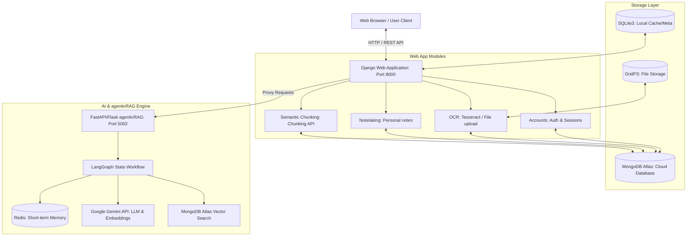
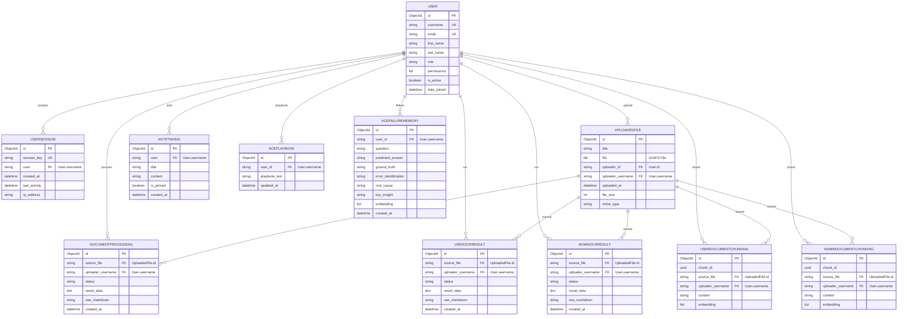

# Hệ thống Trò chuyện Thông minh Doanh nghiệp WoxionChat (Tích hợp ACE Engine)

WoxionChat là một nền tảng Chatbot AI cấp doanh nghiệp kết hợp sức mạnh của Django Backend, dịch vụ đặc vụ thông minh agenticRAG (FastAPI và LangGraph), cơ chế tự tối ưu hóa ngữ cảnh ACE (Agentic Context Engineering), cùng các công nghệ trích xuất tri thức tiên tiến như OCR và Semantic Chunking.

Hệ thống được thiết kế theo cấu trúc modular, hiệu năng cao, dễ mở rộng, cho phép xây dựng các trợ lý AI có khả năng hiểu ngữ cảnh sâu sắc, tự học hỏi từ phản hồi của người dùng để liên tục cải thiện câu trả lời mà không cần huấn luyện lại mô hình (Fine-tuning).

---

## Tính năng nổi bật

### 1. Đặc vụ Hội thoại Thông minh (Agentic RAG)
* **Luồng Trạng thái LangGraph**: Sử dụng LangGraph để xây dựng quy trình hội thoại thông qua sơ đồ trạng thái (State Graph), kiểm soát ý định người dùng (Query Classification), và tự động chuyển đổi giữa trả lời trực tiếp (Direct Reply) hoặc truy xuất tài liệu (RAG).
* **Truy xuất Song song (Parallel Retrieval)**: Tìm kiếm đồng thời trên tài liệu cá nhân của người dùng (UserDocumentChunking) và tri thức chung của hệ thống (AdminDocumentChunking), giúp giảm hơn 40% độ trễ.
* **Tái xếp hạng tài liệu (Reranking Node)**: Lọc và sắp xếp lại các kết quả tìm kiếm ngữ nghĩa thô để chỉ giữ lại các tài liệu có độ tương quan cao nhất trước khi đưa vào mô hình ngôn ngữ lớn (Gemini), hạn chế tình trạng nhiễu thông tin.
* **Quản lý bộ nhớ (Redis Memory)**: Quản lý vết hội thoại thời gian thực bằng Redis (Short-term memory), kết hợp tóm tắt lịch sử hội thoại dài hạn.

### 2. Cơ chế Tự học và Tự tối ưu Ngữ cảnh (ACE Engine)
* **Active Learning Feedback Loop**: Khi người dùng không hài lòng với câu trả lời (bấm nút "Thumbs Down"), hệ thống sẽ yêu cầu người dùng cung cấp câu trả lời đúng (Ground Truth).
* **Failure Memory và Playbooks**: Bộ Reflector của ACE phân tích nguyên nhân lỗi (Root Cause) và lưu trữ vector lỗi vào AceFailureMemory. Đồng thời cập nhật các quy tắc hướng dẫn mới vào cẩm nang tự học AcePlaybook của người dùng đó.
* **Few-shot Prompting Tự động**: Ở các hội thoại tiếp theo, khi nhận thấy câu hỏi tương tự lỗi cũ, hệ thống sẽ tự động chèn hướng dẫn từ Playbook và bài học từ lỗi cũ vào System Prompt để dẫn dắt mô hình trả lời đúng theo chuẩn mới.

### 3. Trích xuất Tài liệu (OCR) và Phân đoạn Ngữ nghĩa (Semantic Chunking)
* **Xử lý tài liệu OCR**: Nhận dạng ký tự quang học từ ảnh/PDF bằng Tesseract OCR, kết hợp mô hình Mistral AI để tái cấu trúc văn bản thô thành định dạng Markdown có tổ chức (bảng biểu, tiêu đề, danh sách).
* **Semantic Chunking**: Phân mảnh tài liệu động bằng cách tính khoảng cách cosine giữa vector embedding (BGE-M3) của các câu liên tiếp, tránh làm mất ngữ cảnh ở giữa câu như các phương pháp phân mảnh cố định (Fixed-size Chunking).
* **Phân quyền Tri thức**: Tài liệu Admin tải lên trở thành Tri thức Hệ thống dùng chung, trong khi tài liệu User tải lên chỉ phục vụ truy xuất cá nhân của User đó.

### 4. Quản lý Tài khoản và Ghi chú (Web Application Layers)
* **Custom Mongo Auth Backend**: Xác thực tùy biến trực tiếp thông qua cơ sở dữ liệu MongoDB Atlas cho tài khoản thường, hỗ trợ đồng thời đăng nhập mạng xã hội (Google OAuth2).
* **Ghi chú nhanh (Notetaking)**: Hỗ trợ người dùng tạo, sửa, ghim ghi chú cá nhân trực tiếp trên giao diện chat nâng cao để lưu trữ nhanh các thông tin quan trọng.
* **Quản lý phiên đăng nhập (UserSession)**: Quản lý thiết bị và hoạt động đăng nhập của tài khoản.

---

## Kiến trúc Hệ thống (System Architecture)

Hệ thống WoxionChat tuân theo kiến trúc Client-Server lai giữa Monolith (Django) và Microservice (agenticRAG) nhằm tách biệt tài nguyên tính toán AI chuyên sâu khỏi các tác vụ nghiệp vụ Web thông thường.

### Sơ đồ Kiến trúc Tổng thể (High-Level Architecture)



### Chi tiết các tầng kiến trúc
1. **Presentation Layer (Tầng hiển thị)**: Xây dựng bằng HTML, Vanilla CSS, JS trên Django Templates để cung cấp giao diện Chat nâng cao (Advanced Chat), quản lý ghi chú, upload tài liệu trực quan.
2. **Web Application Layer (Django - Cổng 8000)**: Đóng vai trò là Gateway tiếp nhận request, xử lý xác thực, phân quyền, quản lý tài liệu và chuyển tiếp các luồng hội thoại AI sang đặc vụ RAG.
3. **Agentic RAG Layer (FastAPI/Flask - Cổng 5002)**: Microservice AI độc lập, vận hành sơ đồ LangGraph để xử lý logic RAG, Rerank, kết nối Gemini API, và tương tác với Redis Cache.
4. **Data Layer (Tầng dữ liệu)**:
   * **MongoDB Atlas**: Lưu trữ các collection về User, Session, OCR Result, Playbooks, Failure Memories và Notes.
   * **GridFS**: Lưu trữ các file tài liệu ảnh/PDF dung lượng lớn.
   * **Redis**: Bộ nhớ đệm ngắn hạn phục vụ lưu trữ trạng thái hội thoại thời gian thực.
   * **SQLite3**: Lưu thông tin cấu trúc bổ trợ cho Django trong môi trường phát triển (metadata).

---

## Thiết kế Cơ sở Dữ liệu (Database Schema)

Hệ thống quản lý dữ liệu linh hoạt trên MongoDB Atlas thông qua thư viện Mongoengine. 



---

## Hướng dẫn Cài đặt và Khởi chạy (Setup Instructions)

### 1. Cài đặt các Tiền đề Hệ thống (System Prerequisites)

Hệ thống yêu cầu cài đặt sẵn Python, Tesseract OCR và Redis trên máy chủ hoặc thiết bị phát triển cục bộ.

#### Cài đặt Tesseract OCR:
* **macOS**:
  ```bash
  brew install tesseract
  ```
* **Ubuntu/Linux**:
  ```bash
  sudo apt-get update
  sudo apt-get install tesseract-ocr
  ```
* **Windows**: Tải file cài đặt từ thư viện chính thức và cấu hình biến môi trường Path trỏ đến file tesseract.exe.

#### Cài đặt và Chạy Redis:
* **macOS**:
  ```bash
  brew install redis
  brew services start redis
  ```
* **Ubuntu/Linux**:
  ```bash
  sudo apt install redis-server
  sudo systemctl start redis-server
  ```

---

### 2. Thiết lập Biến Môi trường (Environment Variables)

Sao chép và thiết lập cấu hình trong tệp .env tại thư mục /WoxionChat:

```bash
cd WoxionChat
cp .env.example .env
```

Các biến môi trường chính cần điền:
* `GOOGLE_API_KEY`: API Key của Google Gemini dùng cho LLM và nhúng vector.
* `MONGO_CONNECTION_STRING` và `MONGODB_ATLAS_URI`: Link kết nối tới Database MongoDB Atlas của bạn.
* `MONGODB_ATLAS_DB`: Tên cơ sở dữ liệu (ví dụ: local-bot).
* `REDIS_HOST` và `REDIS_PORT` và `REDIS_PASSWORD`: Thông tin kết nối máy chủ Redis của bạn.
* `MISTRAL_API_KEY`: (Tùy chọn) API key phục vụ tái cấu trúc layout OCR.
* `GOOGLE_OAUTH2_CLIENT_ID` và `GOOGLE_OAUTH2_CLIENT_SECRET`: (Tùy chọn) Cấu hình Google OAuth2 cho tính năng Social Login.

---

### 3. Tạo Môi trường Ảo và Cài đặt thư viện Python

Hệ thống khuyến nghị sử dụng công cụ quản lý package nhanh uv hoặc công cụ pip truyền thống.

#### Sử dụng uv (Khuyên dùng):
1. Cài đặt uv (nếu chưa có):
   ```bash
   curl -LsSf https://astral.sh/uv/install.sh | sh
   ```
2. Cài đặt dependencies và tạo môi trường ảo tại thư mục /WoxionChat:
   ```bash
   cd WoxionChat
   uv venv
   source .venv/bin/activate  # Trên macOS/Linux
   # .venv\Scripts\activate   # Trên Windows
   uv pip install -r requirements.txt
   ```

#### Sử dụng pip:
```bash
cd WoxionChat
python -m venv .venv
source .venv/bin/activate  # Trên macOS/Linux
# .venv\Scripts\activate   # Trên Windows
pip install -r requirements.txt
```

---

### 4. Khởi tạo Cơ sở Dữ liệu

Khởi chạy lệnh migrate của Django để khởi tạo các bảng siêu dữ liệu (metadata) trên SQLite local:

```bash
python manage.py migrate
python manage.py createsuperuser  # Tạo tài khoản quản trị hệ thống
```

---

### 5. Khởi chạy Ứng dụng (Development Mode)

Dự án cung cấp một script Python giúp chạy đồng thời cả hai dịch vụ (FastAPI agenticRAG trên cổng 5002 và Django Web Server trên cổng 8000):

```bash
python run_dev.py
```

* **Dịch vụ FastAPI**: Chạy tại http://127.0.0.1:5002/ (Tài liệu API Swagger tại /docs).
* **Dịch vụ Django**: Chạy tại http://127.0.0.1:8000/.
* **Dừng ứng dụng**: Nhấn Ctrl + C để script tự động dọn dẹp và tắt cả hai tiến trình.

---

### 6. Khởi chạy bằng Docker (Docker Deployment Mode)

Dự án cung cấp tệp cấu hình Dockerfile và docker-compose.yml tại thư mục /WoxionChat để triển khai ứng dụng dưới dạng Container hóa một cách dễ dàng.

#### Yêu cầu:
* Đã cài đặt Docker và Docker Compose trên máy chủ.
* Đã hoàn thiện file `/WoxionChat/.env` như hướng dẫn tại mục 2.

#### Các bước khởi chạy:
1. Di chuyển vào thư mục `/WoxionChat`:
   ```bash
   cd WoxionChat
   ```
2. Thực hiện build và kích hoạt các container dịch vụ:
   ```bash
   docker compose up --build -d
   ```
3. Sau khi khởi chạy thành công, Docker sẽ tự động kích hoạt 2 dịch vụ chính:
   * **woxionchat-web**: Web Django phục vụ tại cổng 8000 (http://localhost:8000/).
   * **woxionchat-agentic-rag**: Đặc vụ AI FastAPI phục vụ tại cổng 5002 (http://localhost:5002/).
4. Dừng hệ thống container:
   ```bash
   docker compose down
   ```

---

## Thử nghiệm và Chạy Độc lập Khung Tự học ACE (ACE Engine Standalone)

Nếu bạn muốn chạy thử nghiệm, đánh giá các bộ Dataset tài chính hoặc mô phỏng (AppWorld, FiNER, XBRL Formula) độc lập với ứng dụng Web:

1. Di chuyển vào thư mục /ace:
   ```bash
   cd ace
   uv sync
   cp .env.example .env  # Điền API keys (OpenAI / SambaNova / Together AI)
   ```
2. Chạy huấn luyện ngoại tuyến (Offline Adaptation) trên tác vụ FiNER:
   ```bash
   uv run python -m eval.finance.run --task_name finer --mode offline --save_path results
   ```
3. Chạy thử nghiệm với cơ chế RAE (Retrieval-Augmented Execution) kết hợp Analogical Reflection:
   ```bash
   uv run python -m eval.finance.run \
       --task_name finer \
       --mode offline \
       --save_path results \
       --use_rae --rae_top_k 10 \
       --use_failure_memory --failure_memory_top_k 3
   ```
Các playbook tối ưu và báo cáo kết quả sẽ được xuất ra thư mục results/.
