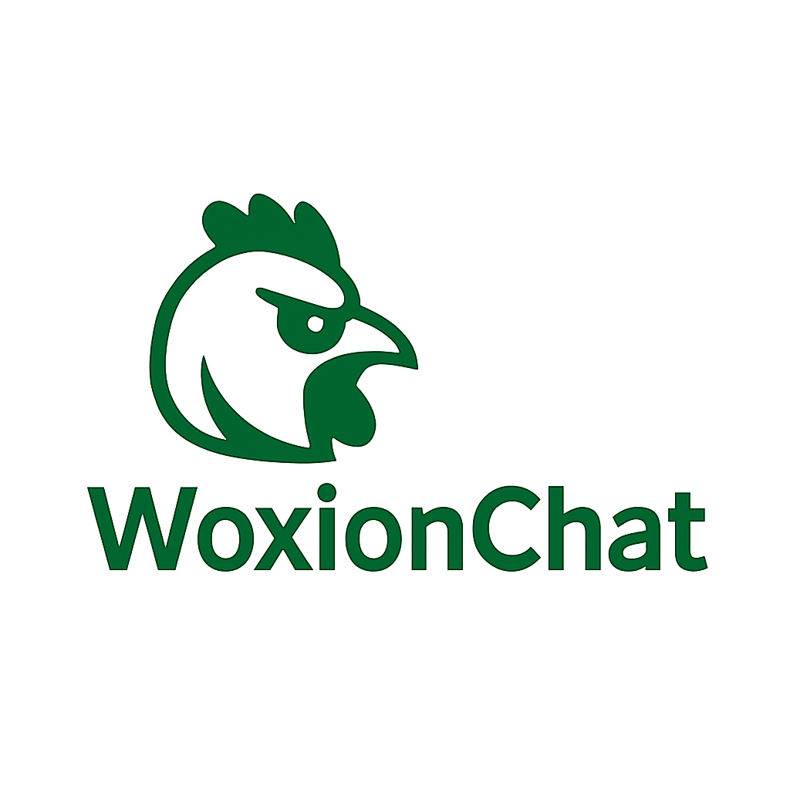

# WoxionChat – AI-Powered Enterprise Chatbot Platform  


## Overview

**WoxionChat** is an enterprise-grade AI chatbot platform built using Django and Python. It empowers organizations to deliver intelligent, multimodal conversational experiences across websites, support systems, and internal knowledge bases by leveraging Retrieval-Augmented Generation (RAG), OCR, and voice technologies.

Designed to be modular, extensible, and developer-friendly, WoxionChat provides a complete infrastructure to deploy real-time, context-aware, AI-driven assistants.

---

## 🚀 Key Capabilities

### 🤖 Conversational AI Engine  
Generate human-like responses based on input queries using semantic understanding and knowledge integration.

### 🧠 Semantic Chunking  
Advanced text segmentation engine that prepares long documents for retrieval and contextual understanding.

### 📚 Agentic RAG (Retrieval-Augmented Generation)  
Combines generative AI with vector-based document retrieval, enabling responses grounded in custom knowledge sources.

### 💬 Support Automation  
Pre-built chatbot module for customer service with FAQ matching and escalation support.

### 👁️ Document Intelligence (OCR)  
Extracts textual data from uploaded images or PDFs using integrated Optical Character Recognition.

### 🔊 Text-to-Speech (TTS)  
Supports spoken responses using natural voice synthesis engines.

### 👥 User & Auth Management  
Comprehensive user system with registration, login, roles, and permissions using Django Auth and REST framework.

### ⚡ Real-time Communication  
Integrated WebSocket layer (via Django Channels and Redis) for live chat interactions.

---

## ⚙️ Technology Stack

| Layer         | Technologies                                      |
|---------------|--------------------------------------------------|
| Backend       | Python 3.x, Django 5.2+                           |
| AI Integration| LangChain, Google Generative AI, LangGraph       |
| Realtime      | Django Channels, Redis                            |
| OCR/TTS       | Tesseract, gTTS/PyTTSx3 (or cloud APIs)           |
| Database      | SQLite3 (Dev), MongoDB (Production supported)     |
| API Layer     | Django REST Framework, WebSocket APIs             |
| Frontend      | HTML, CSS, JavaScript (Django templates)          |

---

## 📁 Project Structure

```
Bot_LOCAL/
├── WoxionChat/          # Core Django project
├── SupportChatbot/      # Customer support bot module
├── agenticRAG/          # Retrieval-Augmented Generation engine
├── OCRfeature/          # OCR integration
├── TextToSpeech/        # TTS functionality
├── SemanticChunking/    # NLP text processing
├── accounts/            # User authentication and roles
├── templates/           # HTML frontend templates
├── static/              # Static files (CSS, JS, images)
└── requirements.txt     # Project dependencies
```

---

## 🛠️ Setup Instructions

### 1. Clone the Repository

```bash
git clone <your-repository-url>
cd Bot_LOCAL
```

### 2. Create a Virtual Environment

```bash
python -m venv .venv

# Windows
.venv\Scripts\activate

# macOS/Linux
source .venv/bin/activate
```

### 3. Install Python Dependencies

```bash
pip install -r requirements.txt
```

### 4. Configure Environment Variables

```bash
cp .env.example .env
# Then manually edit `.env` with your API keys and settings
```

### 5. Initialize Database

```bash
python manage.py migrate
python manage.py createsuperuser  # Optional: for admin access
```

### 6. Launch Development Server

```bash
python manage.py runserver
```

Then access: [http://127.0.0.1:8000/](http://127.0.0.1:8000/)

---

## 🔧 Functional Modules

- **Web Chat UI**: Available on root path for human-AI interaction  
- **Admin Dashboard**: Access via `/admin/` for user & content management  
- **REST API**: For programmatic integrations  
- **WebSocket API**: For real-time chat functionality  
- **Document Upload**: OCR feature accessible through web UI  
- **Voice Mode**: Text-to-speech enabled response on demand

---

## 🧑‍💻 Contribution Guide

We welcome contributions from the open-source community.

1. Fork the repo  
2. Create a feature branch  
   ```bash
   git checkout -b feature/your-feature
   ```
3. Commit your changes  
   ```bash
   git commit -m 'Add new feature'
   ```
4. Push to your fork  
   ```bash
   git push origin feature/your-feature
   ```
5. Submit a Pull Request

---

## 📄 License

This project is licensed under the MIT License. See the [LICENSE](LICENSE) file for details.

---

## 📬 Contact

For support, business inquiries, or partnerships:

- **Email**: [Your Email]
- **GitHub**: [Your GitHub Profile]
- **LinkedIn**: [Your LinkedIn Profile]

---

## 🙏 Acknowledgments

We extend our deepest gratitude to the global open-source community and to the brilliant developers behind the libraries, frameworks, and tools that make this project not only possible but powerful. Your commitment to sharing knowledge, writing elegant code, and solving hard problems has laid the foundation upon which WoxionChat is built. 
