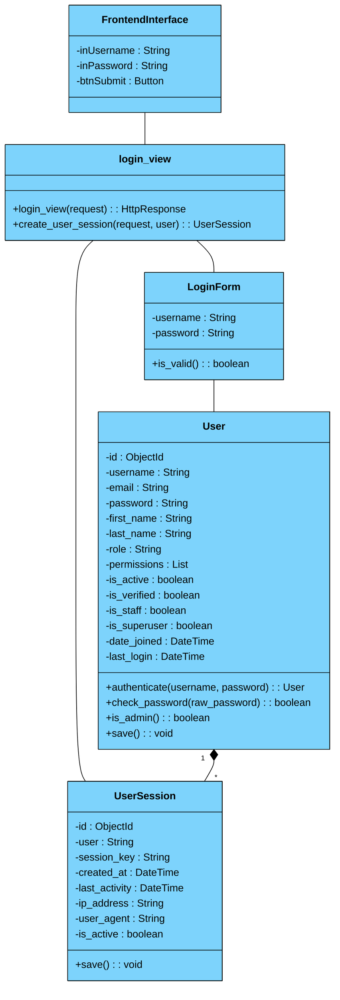
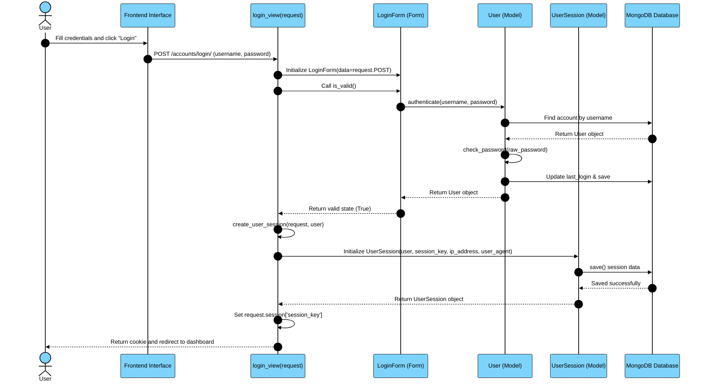
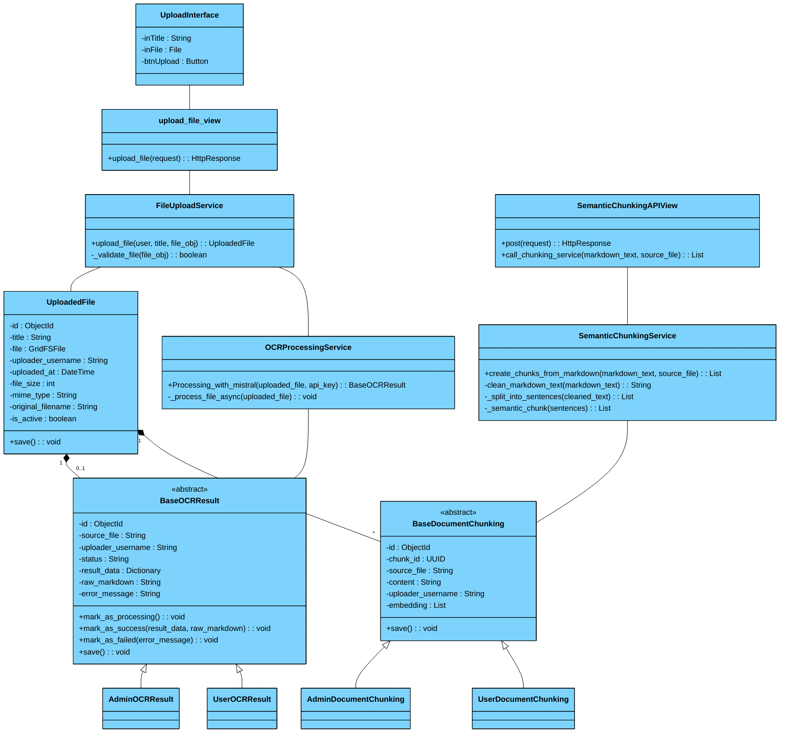
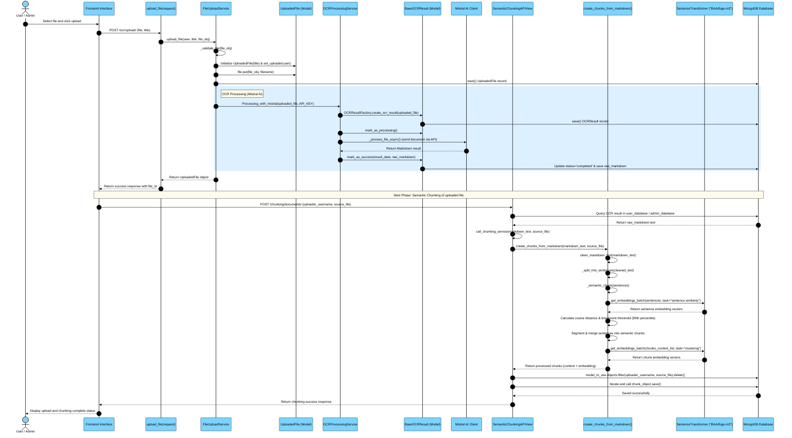
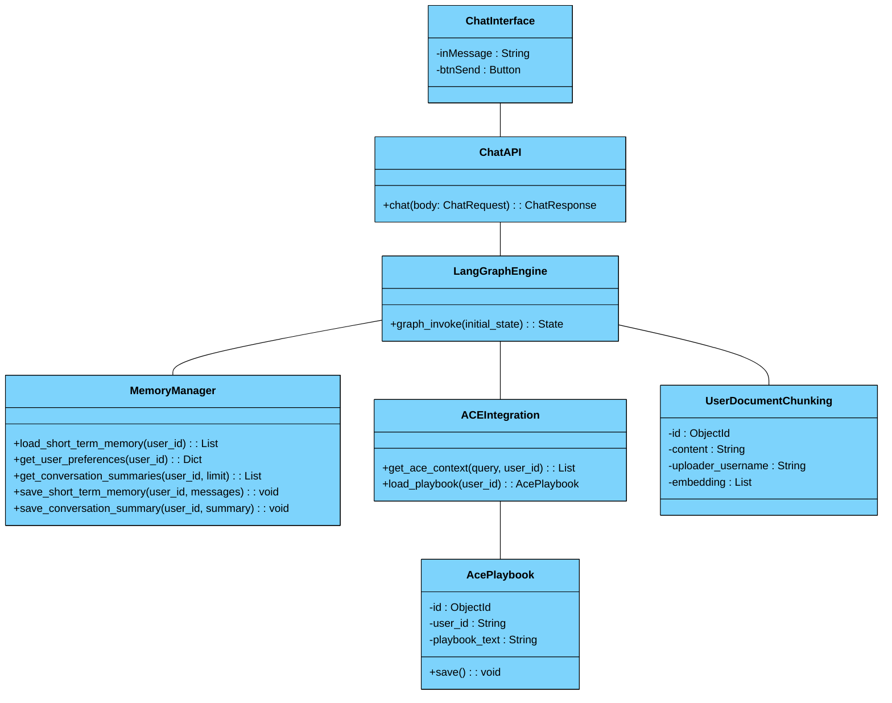
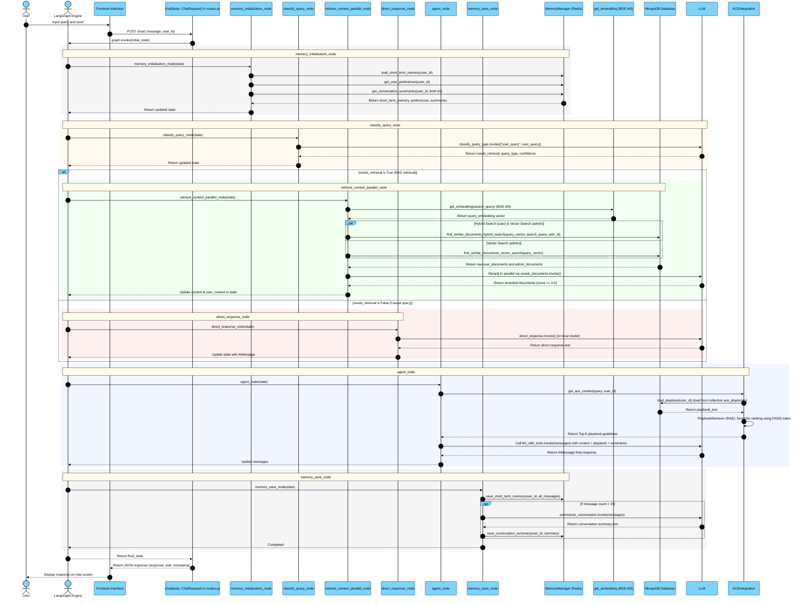
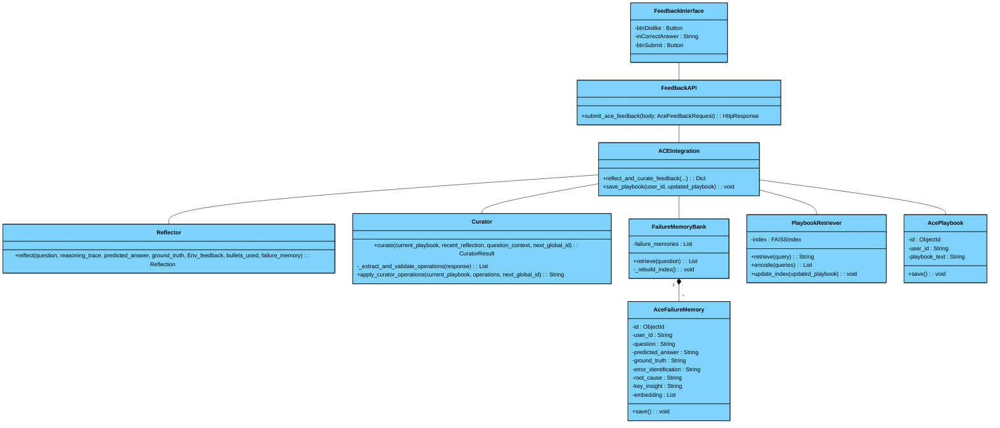
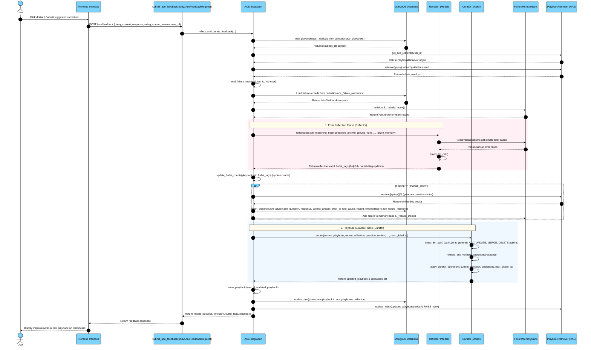

# SYSTEM MODULES REQUIREMENT ANALYSIS & DESIGN
## WOXIONCHAT PROJECT & ACE SELF-IMPROVEMENT FRAMEWORK

This document contains the detailed analysis of the 4 system modules following standard software engineering practices. Each module includes a Requirement Phase and an Analysis Phase featuring natural language scripts, local UML Class Diagrams, local Sequence Diagrams, and detailed functional analysis.

---

# TABLE OF CONTENTS
1. [MODULE 1: USER MANAGEMENT MODULE](#1-module-1-user-management-module)
2. [MODULE 2: DOCUMENT UPLOAD & MANAGEMENT MODULE](#2-module-2-document-upload--management-module)
3. [MODULE 3: CHATBOT INTERACTION MODULE (AGENTIC RAG)](#3-module-3-chatbot-interaction-module-agentic-rag)
4. [MODULE 4: SELF-IMPROVING MODULE (ACE INTEGRATION)](#4-module-4-self-improving-module-ace-integration)

---

# 1. MODULE 1: USER MANAGEMENT MODULE

## SI. Requirement Phase
*   **Purpose:** The module allows users to register, log in securely, and update personal profiles, while providing an administrative interface for the Admin to manage user roles, permissions, and account status.
*   **1.1. Business Description:**
    *   The system allows visitors to access the registration page by entering Username, Email, First & Last Name, and Password. The system automatically validates email format and password strength, hashing the password before storage.
    *   The system provides secure authentication via username and password, creating and updating session records (`UserSession`) that track IP addresses and client devices.
    *   Successfully logged-in users can view and update their personal profiles or change passwords.
    *   The system provides a dedicated admin dashboard for administrators to view all users, toggle user roles (`role` between `admin` and `user`), and suspend or reactivate accounts.
*   **1.2. Use Cases:**
    *   **User Registration:** Allows new users to create accounts.
    *   **System Authentication:** Validates user identity using username and password.
    *   **Profile Updates:** Allows users to modify their display information.
    *   **User Account Management (Admin):** Allows administrators to modify roles and activate/deactivate accounts.
*   **1.3. Use Case Diagram:**
    ```mermaid
    %%{init: {
      'theme': 'base',
      'themeVariables': {
        'primaryColor': '#ffffff',
        'primaryTextColor': '#000000',
        'primaryBorderColor': '#000000',
        'lineColor': '#000000'
      }
    }}%%
    flowchart LR
        actorUser["a<br/><br/>User"]
        actorAdmin["a<br/><br/>Admin"]

        style actorUser fill:none,stroke:none;
        style actorAdmin fill:none,stroke:none;

        subgraph SystemBoundary ["User Management System"]
            ucRegister(["User Registration"])
            ucLogin(["System Authentication"])
            ucProfile(["Profile Updates"])
            ucManage(["User Account Management"])

            style ucRegister fill:#ffffff,stroke:#000000,stroke-width:1px;
            style ucLogin fill:#ffffff,stroke:#000000,stroke-width:1px;
            style ucProfile fill:#ffffff,stroke:#000000,stroke-width:1px;
            style ucManage fill:#ffffff,stroke:#000000,stroke-width:1px;
        end

        actorUser --- ucRegister
        actorUser --- ucLogin
        actorUser --- ucProfile

        actorAdmin --- ucManage
        actorAdmin --- ucLogin

        style SystemBoundary fill:#7dd3fc,stroke:#000000,stroke-width:2px;
    ```

## II. Analysis Phase
*   **2.1. Scenario Script:**
    *   **Objective:** Allow users to securely log into the system to access personalized features, and enable administrators to manage user access.
    *   **Main Flow (Login):**
        1. The user accesses the home page and selects the login feature.
        2. The system displays a form requesting account details: username and password.
        3. The user enters their credentials and clicks the submit login button.
        4. The system validates whether the credentials match a registered user account.
        5. If valid, the system records the login timestamp, initializes the current user session, and redirects the user to their dashboard or admin panel based on their role.
    *   **Exceptions:**
        *   At Step 4 (Incorrect Credentials): If the username does not exist or the password is incorrect, the system displays an error message: *"Invalid username or password. Please try again!"* and prompts for re-entry.
        *   At Step 4 (Suspended Account): If the account is locked or suspended, the system displays: *"Account is suspended. Please contact the administrator!"* and blocks access.

*   **2.2. Sơ đồ thực thể của module (UML Class Diagram):**


*   **2.3. Sơ đồ tuần tự của module:**


*   **2.4. Detailed Functional Analysis:**
    *   Click on Login button $\rightarrow$ displays login form $\rightarrow$ handled by `login.html` template (containing input fields `username`, `password`, and submit button).
    *   Submit login credentials $\rightarrow$ invokes `login_view(request)` view $\rightarrow$ instantiates and validates credentials via `LoginForm(request.POST)`.
    *   Authenticate account $\rightarrow$ calls `User.authenticate(username, password)` $\rightarrow$ action of `User` entity class.
    *   Create session $\rightarrow$ calls helper `create_user_session(request, user)` to initialize and store `UserSession` $\rightarrow$ action of `UserSession` entity class.
    *   Save session $\rightarrow$ records `user`, `session_key`, `ip_address`, `user_agent` in MongoDB.
    *   Admin manages roles $\rightarrow$ calls `save()` to overwrite database fields $\rightarrow$ action of `User` entity class.

*   **2.5. Step-by-Step Processing Flow:**
    1. The user visits the homepage, clicks the login link $\rightarrow$ redirects to `login.html` interface.
    2. The user fills in the username and password fields and clicks "Login".
    3. The browser sends a POST request to `login_view(request)` in `views.py`.
    4. The `login_view` instantiates `LoginForm` with the POST data and calls `form.is_valid()`.
    5. During validation, the form authenticates the credentials by calling the class method `User.authenticate(username, password)`.
    6. The `User` model queries MongoDB. If found, it compares passwords using `check_password(raw_password)`. If valid, it updates `last_login = datetime.now()`, saves to DB, and returns the `User` object.
    7. The view receives the authenticated `User` object and calls the helper function `create_user_session(request, user)` in `utils.py`.
    8. `create_user_session` initializes a `UserSession` entity with details (`user` keyed by `username`, `session_key`, `ip_address`, `user_agent`), saves it to MongoDB via `save()`, and updates the session keys in `request.session`.
    9. The `login_view` checks the user role using `user.is_admin()`. If the user is an Admin, they are redirected to `admin_dashboard`; otherwise, they are redirected to the normal `dashboard` (`dashboard.html`).

---

# 2. MODULE 2: DOCUMENT UPLOAD & MANAGEMENT MODULE

## SI. Requirement Phase
*   **Purpose:** The module allows users and administrators to upload document files (text or image) to the system, automatically run OCR via Mistral AI to convert them to Markdown text, and execute Semantic Chunking (using local BGE-M3) to store 1024-dimensional vector chunks for semantic search.
*   **1.1. Business Description:**
    *   The system allows users to upload files. It automatically validates file type and size (accepting `.pdf`, `.docx`, `.png`, `.jpg`, `.jpeg`, `.txt` up to 50MB).
    *   The physical files are stored in MongoDB GridFS, and an `UploadedFile` metadata entity is created to manage file properties.
    *   Once uploaded, the system triggers a background OCR process using the Mistral AI API:
        *   Image files are processed using the `pixtral-12b-2409` vision model.
        *   PDF files are processed using the specialized `mistral-ocr-latest` API.
        *   Word (`.docx`) or text (`.txt`) files are read as raw text and formatted into clean Markdown using `mistral-large-latest`.
    *   The resulting Markdown is stored in the `admin_database` or `user_database` collection (depending on the uploader's role) via the `BaseOCRResult` entity.
    *   The system provides semantic chunking for OCR Markdown files:
        *   Splits text into individual sentences.
        *   Generates sentence embedding vectors using a local BGE-M3 model (`BAAI/bge-m3`).
        *   Calculates cosine distance between adjacent sentences and identifies boundaries (breakpoints) using the 95th percentile threshold.
        *   Groups sentences into semantic chunks and generates a 1024-dimensional embedding vector for each chunk.
        *   Saves chunks into `admin_documents_chunking` or `user_documents_chunking` collection.
*   **1.2. Use Cases:**
    *   **Upload Document:** Upload document files from local device to the system.
    *   **Optical Character Recognition (OCR):** Automatically convert file types (images, PDFs, Docx) into Markdown.
    *   **Document Chunking:** Fragment and vectorize the documents to prepare for the RAG engine.
*   **1.3. Use Case Diagram:**
    ```mermaid
    %%{init: {
      'theme': 'base',
      'themeVariables': {
        'primaryColor': '#ffffff',
        'primaryTextColor': '#000000',
        'primaryBorderColor': '#000000',
        'lineColor': '#000000'
      }
    }}%%
    flowchart LR
        actorUser["a<br/><br/>User/Admin"]
        style actorUser fill:none,stroke:none;

        subgraph SystemBoundary ["Document Ingestion System"]
            ucUpload(["Upload Document"])
            ucOCR(["Run OCR"])
            ucChunk(["Run Semantic Chunking"])

            style ucUpload fill:#ffffff,stroke:#000000,stroke-width:1px;
            style ucOCR fill:#ffffff,stroke:#000000,stroke-width:1px;
            style ucChunk fill:#ffffff,stroke:#000000,stroke-width:1px;
        end

        actorUser --- ucUpload

        ucUpload -.->|"<<include>>"| ucOCR
        ucOCR -.->|"<<include>>"| ucChunk

        style SystemBoundary fill:#7dd3fc,stroke:#000000,stroke-width:2px;
    ```

## II. Analysis Phase
*   **2.1. Scenario Script:**
    *   **Objective:** Enable users to upload personal or shared documents, convert raw images/text files into formatted markdown, and partition contents into logical segments for precise retrieval by the chatbot.
    *   **Main Flow:**
        1. The user navigates to the document upload page via the menu.
        2. The system displays a form requesting a document title and file upload area.
        3. The user inputs a title, selects a file, and clicks the upload button.
        4. The system validates the file format and size.
        5. The system saves the file in internal storage and creates a metadata record.
        6. The system triggers a background OCR process and marks the file status as "processing".
        7. Once OCR completes, the system updates the status to "completed" and saves the structured Markdown text in the database (categorized by user or admin database).
        8. The system triggers the semantic chunking process.
        9. The system cleanses text, segments content based on semantic boundaries between sentences, and vectorizes each chunk.
        10. The system stores segment vectors in the retrieval database (matching uploader role) and ends the process.
    *   **Exceptions:**
        *   At Step 4 (Invalid file): If file type is unsupported or size exceeds 50MB, the system prompts: *"Invalid file type or size exceeds limit!"* and stops.
        *   At Step 7 (OCR fails): If OCR encounters errors or API fails, the system logs the error message, updates status to "failed", and alerts the user.

*   **2.2. Sơ đồ thực thể của module (UML Class Diagram):**


*   **2.3. Sơ đồ tuần tự của module:**


*   **2.4. Detailed Functional Analysis:**
    *   Navigate to upload page $\rightarrow$ displays file selector form $\rightarrow$ handled by `upload.html` template.
    *   Upload document file $\rightarrow$ calls `upload_file(request)` view $\rightarrow$ forwards payload to `FileUploadService.upload_file(user, title, file_obj)`.
    *   Validate and save file $\rightarrow$ calls `_validate_file(file_obj)` and saves via MongoEngine GridFS in `UploadedFile` model.
    *   Trigger and process OCR $\rightarrow$ calls `OCRProcessingService.Processing_with_mistral(uploaded_file, api_key)` to call the Mistral AI API.
    *   Update OCR status $\rightarrow$ updates via `mark_as_processing()`, `mark_as_success(result_data, raw_markdown)`, `mark_as_failed(error_message)` on the `BaseOCRResult` entity class.
    *   Semantic chunking trigger $\rightarrow$ triggers the POST API endpoint of `SemanticChunkingAPIView`.
    *   Sentence splitting & vectorization $\rightarrow$ calls `create_chunks_from_markdown(markdown_text, source_file)` service method to partition the text and generate vectors using local BGE-M3.
    *   Save chunks $\rightarrow$ calls `save()` method on `AdminDocumentChunking` or `UserDocumentChunking` model.

*   **2.5. Step-by-Step Processing Flow:**
    1. User accesses the upload section via menu $\rightarrow$ browser displays `upload.html`.
    2. User fills the title, selects a file, and clicks "Upload".
    3. A POST request is sent to `upload_file(request)` in `views.py` of the OCR application.
    4. The view retrieves the User object from the session and calls `FileUploadService.upload_file(user, title, file_obj)`.
    5. `FileUploadService` validates the file using `_validate_file(file_obj)` (checking types and size $\le$ 50MB).
    6. If valid, the file is saved into MongoDB GridFS, and an `UploadedFile` metadata record is created.
    7. Next, `FileUploadService` triggers the OCR background worker calling `OCRProcessingService.Processing_with_mistral(uploaded_file, api_key)`.
    8. `OCRProcessingService` calls `OCRResultFactory.create_ocr_result` to initialize an `AdminOCRResult` or `UserOCRResult` based on user role, marks it as `processing`, and saves it to MongoDB.
    9. `OCRProcessingService` asynchronously calls the Mistral AI API (Pixtral for images, OCR API for PDFs, or Large for Docx) to get raw Markdown text.
    10. Upon success, the service calls `mark_as_success(result_data, raw_markdown)`, saving the Markdown text and updating the status to `completed`.
    11. The view returns file metadata and redirects the user to the `file_detail.html` details page.
    12. On page load, an AJAX POST request is triggered to `/chunking/documents/`, handled by `SemanticChunkingAPIView`.
    13. `SemanticChunkingAPIView` fetches `raw_markdown` from the database, then calls the asynchronous task `create_chunks_from_markdown(markdown_text, source_file)`.
    14. The method cleanses text via `clean_markdown_text()`, splits it into sentences via `_split_into_sentences()`, and vectorizes sentences using local BGE-M3.
    15. The chunking logic calculates cosine distance between adjacent sentences and identifies breakpoints (using 95th percentile). Sentences are grouped into semantic chunks, and BGE-M3 is called to generate 1024-dimensional vectors.
    16. The processed list of chunks is returned to the `SemanticChunkingAPIView`.
    17. The view deletes stale chunks for the file, bulk saves new `AdminDocumentChunking` or `UserDocumentChunking` records in MongoDB, and returns success.

---

# 3. MODULE 3: CHATBOT INTERACTION MODULE (AGENTIC RAG)

## SI. Requirement Phase
*   **Purpose:** The module provides a chatbot interface that accepts user queries and generates accurate responses using Advanced RAG (parallel semantic retrieval, document reranking, short-term history and preferences stored in Redis, and ACE prompt playbooks).
*   **1.1. Business Description:**
    *   The system allows users to enter questions in the chat box.
    *   The system automatically retrieves session information and short-term chat history from Redis, alongside user preferences and long-term conversation summaries to construct context.
    *   The system classifies the user's intent to optimize the response pipeline:
        *   Social queries (greetings, thank you, etc.) trigger direct responses without retrieval to minimize latency and cost.
        *   Informational queries trigger RAG database search.
    *   During RAG retrieval, the system vectorizes the question using local BGE-M3 and performs parallel search:
        *   Hybrid Search (combining vector search and text search) on `user_documents_chunking` (filtered by username).
        *   Vector Search on `admin_documents_chunking` (general system knowledge).
    *   The system reranks retrieved document chunks using LLM, keeping only chunks with scores $\ge 0.5$.
    *   The system invokes `ACEIntegration` to retrieve the user's personalized playbook (filtered using FAISS index), injecting custom system prompt guidelines.
    *   The chatbot Agent (LLM) aggregates context, rules, and history to formulate the final response.
    *   The system saves the new message to Redis. If history exceeds 15 messages, it triggers LLM summarization and saves the summary long-term.
*   **1.2. Use Cases:**
    *   **Submit Question:** Send user messages to the chatbot.
    *   **Retrieve Context (RAG):** Retrieve related document contents.
    *   **Generate Response:** Synthesize smart response using LLM.
*   **1.3. Use Case Diagram:**
    ```mermaid
    %%{init: {
      'theme': 'base',
      'themeVariables': {
        'primaryColor': '#ffffff',
        'primaryTextColor': '#000000',
        'primaryBorderColor': '#000000',
        'lineColor': '#000000'
      }
    }}%%
    flowchart LR
        actorUser["a<br/><br/>User"]
        style actorUser fill:none,stroke:none;

        subgraph SystemBoundary ["Chatbot Interaction System"]
            ucSubmit(["Submit Question"])
            ucRetrieve(["Retrieve Context - RAG"])
            ucGenerate(["Generate Response"])

            style ucSubmit fill:#ffffff,stroke:#000000,stroke-width:1px;
            style ucRetrieve fill:#ffffff,stroke:#000000,stroke-width:1px;
            style ucGenerate fill:#ffffff,stroke:#000000,stroke-width:1px;
        end

        actorUser --- ucSubmit

        ucSubmit -.->|"<<include>>"| ucGenerate
        ucRetrieve -.->|"<<extend>>"| ucSubmit

        style SystemBoundary fill:#7dd3fc,stroke:#000000,stroke-width:2px;
    ```

## II. Analysis Phase
*   **2.1. Scenario Script:**
    *   **Objective:** Enable users to chat and query knowledge from personal and system documents naturally and accurately.
    *   **Main Flow:**
        1. The user inputs their message/question in the chat interface and clicks send.
        2. The system receives the question, and loads recent chat history, user preferences, and summaries from the cache to establish context.
        3. The system analyzes the query to determine the user's intent.
        4. For informational queries, the system queries the user's private chunks and the admin system chunks in parallel, then reranks the candidates to select the most relevant chunks.
        5. The system compiles retrieved segments, conversation history, and personalized ACE guidelines to ask the LLM to generate the final response.
        6. The system updates the short-term chat history in cache.
        7. The chat interface displays the response to the user.
    *   **Exceptions:**
        *   At Step 5 (No documents found): If no relevant documents are found, the system relies on LLM general knowledge, informs the user gracefully, and skips the RAG context injection.

*   **2.2. Sơ đồ thực thể của module (UML Class Diagram):**


*   **2.3. Sơ đồ tuần tự của module:**


*   **2.4. Detailed Functional Analysis:**
    *   Submit question $\rightarrow$ display query on chatbot interface $\rightarrow$ handled by `chat.html` template.
    *   Forward chat request $\rightarrow$ calls POST `/chat` API $\rightarrow$ handled by `chat(body, request)` in `routes.py`.
    *   Initialize conversation memory $\rightarrow$ calls `load_short_term_memory(user_id)`, `get_user_preferences(user_id)` and `get_conversation_summaries(user_id)` $\rightarrow$ actions of `MemoryManager` class (Redis).
    *   Classify question intent $\rightarrow$ invokes `classify_query_type` tool $\rightarrow$ determines if query requires retrieval or is a casual chat.
    *   Query documents $\rightarrow$ calls `find_similar_documents_hybrid_search` and `find_similar_documents_vector_search` $\rightarrow$ queries MongoDB via `db.py` module.
    *   Rerank retrieved docs $\rightarrow$ calls `rerank_documents` tool using LLM to score relevance.
    *   Retrieve ACE playbook rules $\rightarrow$ calls `ACEIntegration.get_ace_context` $\rightarrow$ returns Top-K relevant guidelines.
    *   Save history and summaries $\rightarrow$ calls `save_short_term_memory` and `save_conversation_summary` $\rightarrow$ actions of `MemoryManager` class.

*   **2.5. Step-by-Step Processing Flow:**
    1. The user types their question and clicks send on the `chat.html` interface.
    2. The browser sends an HTTP POST `/chat` request containing message details and user ID to the FastAPI router.
    3. The FastAPI router invokes `chat(body, request)` in `routes.py`, initializes `AgentState`, and runs the LangGraph engine (`graph.invoke`).
    4. LangGraph executes the `memory_init` node, calling `MemoryManager` to load short-term history (`load_short_term_memory`), user preferences (`get_user_preferences`), and long-term conversation summaries (`get_conversation_summaries`) from Redis.
    5. The graph transitions to `classify_query`, calling LLM-based classifier `classify_query_type` to determine the value of `needs_retrieval` and `query_type`.
    6. If `needs_retrieval` is True (knowledge query):
        *   The graph transitions to `retrieve_context_parallel`.
        *   The system runs BGE-M3 locally to generate question embedding.
        *   It runs parallel queries: `find_similar_documents_hybrid_search` on user's private chunks and `find_similar_documents_vector_search` on admin system chunks.
        *   It receives the raw records, calls `rerank_documents` via LLM to score similarity, filters items with score $\ge 0.5$, and inserts them into context.
    7. If `needs_retrieval` is False (casual query):
        *   The graph transitions to `direct_response`, calling the LLM directly without RAG context.
    8. The graph transitions to the `agent` node to generate the final response. This node calls class method `ACEIntegration.get_ace_context`.
    9. `ACEIntegration` loads the playbook from `ace_playbooks` collection in MongoDB, and passes it to `PlaybookRetriever` to run the RAE algorithm, fetching the Top-K relevant rules via FAISS.
    10. The `agent` node compiles RAG context, playbook guidelines, chat history, preferences, and summaries into the prompt, calling LLM (`llm_with_tools.invoke`) to yield an `AIMessage` response.
    11. The graph transitions to `memory_save`, calling `MemoryManager` to save the new conversation history in Redis. If count exceeds 15, it runs LLM conversation summarization and calls `save_conversation_summary`.
    12. The graph exits execution, the FastAPI router returns the JSON response, and `chat.html` displays the response on screen.

---

# 4. MODULE 4: SELF-IMPROVING MODULE (ACE INTEGRATION)

## SI. Requirement Phase
*   **Purpose:** The module enables the chatbot to automatically optimize and update prompts (represented as playbook guidelines) for individual users, triggered by their ratings (like/dislike) or corrected answers submitted via the interface.
*   **1.1. Business Description:**
    *   The system displays feedback buttons (Like/Dislike) and correction fields for chatbot responses.
    *   When a user provides feedback, the system triggers the self-improving background loop.
    *   The system loads the user's current playbook from `ace_playbooks` collection and gets the list of active guidelines used.
    *   The system loads past error cases from `ace_failure_memories` collection.
    *   The `Reflector` agent (LLM) performs Root Cause Analysis (RCA) and derives key insights, tagging the playbook guidelines used as `helpful` or `harmful`.
    *   The system automatically updates the helpful/harmful count of these guidelines.
    *   If the user rated with "Dislike" (`thumbs_down`), the system saves the failure case details (question, wrong answer, corrected answer, error identifier, root cause, insight) and the question's embedding vector into `ace_failure_memories`.
    *   The `Curator` agent (LLM) reviews the Reflector insights and generates editing operations (ADD, UPDATE, MERGE, DELETE) to update the playbook.
    *   The system applies the operations, overwrites the playbook record in MongoDB, and updates the FAISS index for `PlaybookRetriever` for instant RAE updates.
*   **1.2. Use Cases:**
    *   **Submit Feedback:** Send feedback rating (like/dislike) and suggested corrections.
    *   **Reflect Errors (Reflector):** Analyze the failure root cause via analogical reasoning.
    *   **Edit Playbook (Curator):** Optimize playbook guidelines automatically.
*   **1.3. Use Case Diagram:**
    ```mermaid
    %%{init: {
      'theme': 'base',
      'themeVariables': {
        'primaryColor': '#ffffff',
        'primaryTextColor': '#000000',
        'primaryBorderColor': '#000000',
        'lineColor': '#000000'
      }
    }}%%
    flowchart LR
        actorUser["a<br/><br/>User"]
        style actorUser fill:none,stroke:none;

        subgraph SystemBoundary ["ACE Self-Improving System"]
            ucFeedback(["Submit Feedback"])
            ucReflect(["Reflect Errors"])
            ucCurate(["Edit Playbook"])

            style ucFeedback fill:#ffffff,stroke:#000000,stroke-width:1px;
            style ucReflect fill:#ffffff,stroke:#000000,stroke-width:1px;
            style ucCurate fill:#ffffff,stroke:#000000,stroke-width:1px;
        end

        actorUser --- ucFeedback

        ucReflect -.->|"<<extend>>"| ucFeedback
        ucCurate -.->|"<<extend>>"| ucFeedback

        style SystemBoundary fill:#7dd3fc,stroke:#000000,stroke-width:2px;
    ```

## II. Analysis Phase
*   **2.1. Scenario Script:**
    *   **Objective:** Enable the chatbot to self-correct and update the prompt playbook using user corrections, improving response quality for subsequent chats without source code changes.
    *   **Main Flow:**
        1. The user clicks the Dislike button on a chatbot response, enters their corrected response, and clicks submit.
        2. The system receives the negative feedback and user's corrected response.
        3. The system opens the user's current playbook guidelines for comparison.
        4. The system retrieves similar past failure memories for contextual comparison.
        5. The system runs the Reflector agent to identify the root cause of the error, and determines which guidelines were helpful or harmful.
        6. The system increments the helpful/harmful count of the active guidelines.
        7. The system saves the new failure scenario (question, chatbot response, and corrected answer) to the failure memories database.
        8. The system runs the Curator agent to formulate concrete edits for the playbook (ADD, UPDATE, MERGE, DELETE).
        9. The system applies the modifications, saving the updated playbook to MongoDB.
        10. The system rebuilds the FAISS indexing and updates the learning dashboard.
    *   **Exceptions:**
        *   At Step 5 (API failure): If the reflection or curation agents fail to reach the LLM API, the system logs the error and falls back to the original playbook to guarantee continuous chatbot operations.

*   **2.2. Sơ đồ thực thể của module (UML Class Diagram):**


*   **2.3. Sơ đồ tuần tự của module:**


*   **2.4. Detailed Functional Analysis:**
    *   Submit feedback rating $\rightarrow$ triggers event on `chat.html` interface.
    *   Send feedback rating & corrections $\rightarrow$ triggers `POST /ace/feedback` API $\rightarrow$ handled by `submit_ace_feedback` in `routes.py`.
    *   Read & save playbooks $\rightarrow$ uses `load_playbook(user_id)` and `save_playbook(user_id, playbook_str)` $\rightarrow$ actions of `ACEIntegration` service class.
    *   Reflect error and tag guidelines $\rightarrow$ calls `Reflector.reflect(...)` using LLM $\rightarrow$ returns insights and helpful/harmful bullet tags.
    *   Save failure case details $\rightarrow$ calls insert into MongoDB collection `ace_failure_memories` with question vector from `PlaybookRetriever`.
    *   Curate playbook guidelines $\rightarrow$ calls `Curator.curate(...)` using LLM to generate operations.
    *   Update RAE semantic index $\rightarrow$ calls `update_index(updated_playbook)` on `PlaybookRetriever` object.

*   **2.5. Step-by-Step Processing Flow:**
    1. User clicks the Dislike icon and submits corrected text on `chat.html` interface.
    2. A POST request is sent to API endpoint `/ace/feedback` of the FastAPI router.
    3. The router calls `submit_ace_feedback(body)` in `routes.py`, processes payload, and calls `ACEIntegration.reflect_and_curate_feedback(...)`.
    4. `ACEIntegration` loads the user's playbook (`load_playbook`) and used guidelines (`PlaybookRetriever.retrieve`).
    5. `ACEIntegration` retrieves past failure cases from `ace_failure_memories` collection and initializes the `FailureMemoryBank`.
    6. `ACEIntegration` invokes `Reflector.reflect(...)`. The `Reflector` calls the LLM to analyze the error and output guideline tags (`bullet_tags` as helpful or harmful).
    7. `ACEIntegration` updates the helpful/harmful counts of the playbook guidelines according to the `bullet_tags` retrieved.
    8. If user dislikes (`thumbs_down`), `ACEIntegration` calls `PlaybookRetriever.encode` to generate the question embedding, saves the details in MongoDB `ace_failure_memories`, and adds it to the `FailureMemoryBank`.
    9. `ACEIntegration` calls `Curator.curate(...)`. The `Curator` calls the LLM to generate edits (ADD, UPDATE, MERGE, DELETE).
    10. `ACEIntegration` applies modifications, calls `save_playbook` to write back to MongoDB `ace_playbooks`, and calls `PlaybookRetriever.update_index` to rebuild the FAISS semantic index.
    11. `ACEIntegration` returns success, and `chat.html` displays the updated playbook details on the dashboard.
